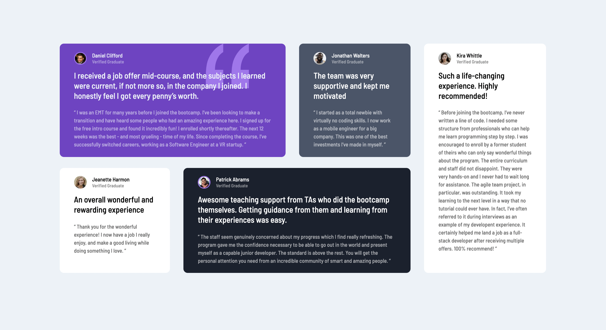

# Frontend Mentor - Testimonials grid section solution

This is a solution to the [Testimonials grid section challenge on Frontend Mentor](https://www.frontendmentor.io/challenges/testimonials-grid-section-Nnw6J7Un7). Frontend Mentor challenges help you improve your coding skills by building realistic projects.

## Table of contents

- [Overview](#overview)
  - [The challenge](#the-challenge)
  - [Screenshot](#screenshot)
  - [Links](#links)
- [My process](#my-process)
  - [Built with](#built-with)
  - [What I learned](#what-i-learned)
  - [Continued development](#continued-development)
  - [Useful resources](#useful-resources)
- [Author](#author)
- [Acknowledgments](#acknowledgments)

**Note: Delete this note and update the table of contents based on what sections you keep.**

## Overview

### The challenge

Users should be able to:

- View the optimal layout for the site depending on their device's screen size

### Screenshot

### Links

- [Github Repository](https://github.com/Barbelitos/FrontEndMentor-TestimonialsGrid)
- [Live Site](https://barbelitos.github.io/FrontEndMentor-TestimonialsGrid/)

## My process

### Built with

- Semantic HTML5 markup
- CSS
- Flexbox
- CSS Grid
- CSS Grid Areas
- Mobile-first workflow

### What I learned

I have taken solid steps to get more comfortable with using CSS Grid, especially grid areas.

### Continued development

My goal is to be able to choose between both Grid or Flexbox, depending on the situation.

### Useful resources

- [CSS-TRICKS - A Complete Guide to Grid](https://css-tricks.com/snippets/css/complete-guide-grid/) - This is a great resource with lots of useful information on how to apply CSS Grid.

## Author

- Github - [@Barbelitos](https://github.com/Barbelitos)
- Frontend Mentor - [@Barbelitos](https://www.frontendmentor.io/profile/Barbelitos)

## Acknowledgments
